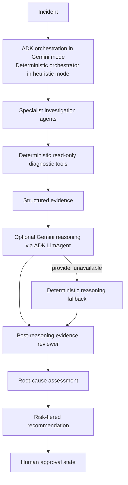
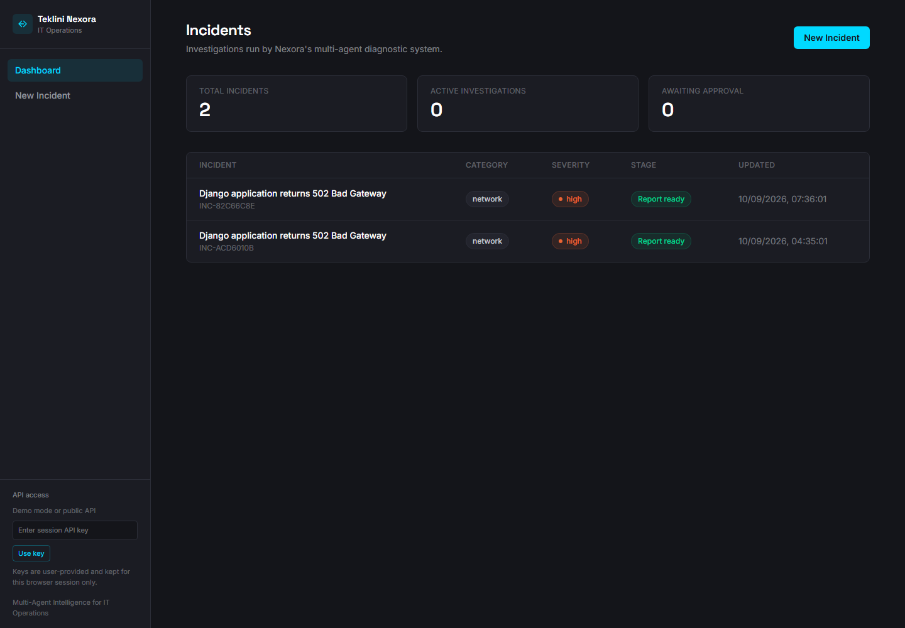
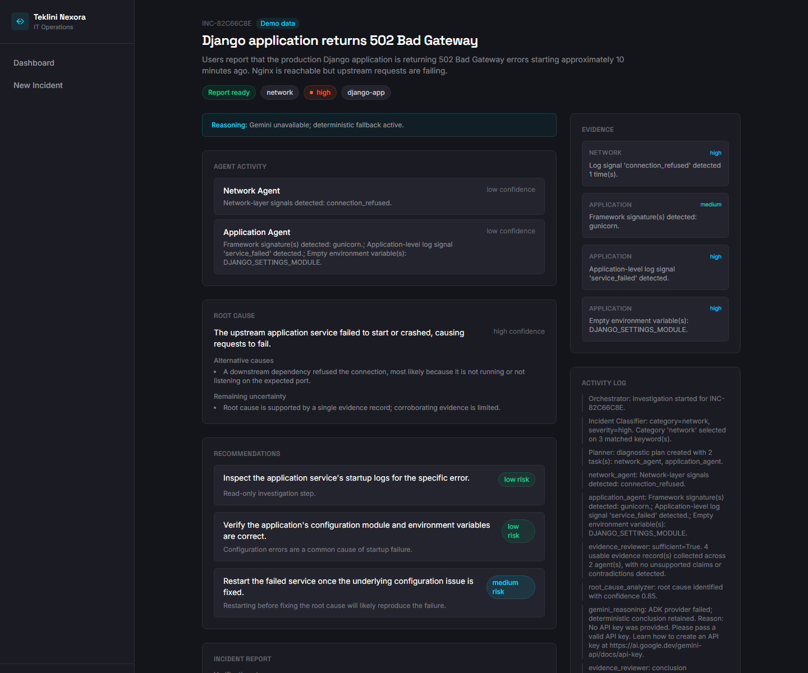

# Teklini Nexora

**Multi-Agent Intelligence for IT Operations**

Built by Bravin Ouma as part of the Teklini Technologies engineering portfolio.

[](pyproject.toml)
[](src/nexora/api)
[](frontend)
[](frontend)
[](ARCHITECTURE.md#adk-and-gemini)
[](LICENSE)

Nexora investigates IT incidents by collecting structured diagnostic evidence and turning it into reviewable findings and recommendations. The default workflow is deterministic. An optional Google ADK and Gemini layer can interpret the evidence, and a separate reviewer checks the resulting claims.

Nexora is a portfolio project for local demonstration and technical evaluation. It does not monitor production systems, administer infrastructure, or replace an operations team.

## Project Status

- **Local demo** – The deterministic investigation path runs without cloud services or API credentials.
- **Optional Gemini reasoning** – Google ADK can coordinate specialist agents to interpret collected evidence.
- **Evidence review** – A separate validation step checks model claims against the supplied evidence.
- **Human approval** – High-risk recommendations require approval; Nexora does not apply changes to infrastructure.
- **Live Gemini status** – Provider execution has not been verified here. The deterministic path is the tested baseline.

## Engineering Highlights

- **Facts before interpretation** – Deterministic tools collect observations before any model reasoning begins.
- **Specialist analysis** – Google ADK coordinates network, systems, application, database, and security agents in Gemini mode.
- **Deterministic fallback** – If Gemini is disabled or unavailable, Nexora keeps the rule-based conclusion.
- **Evidence checks** – A reviewer flags unsupported conclusions, invalid citations, and contradictions.
- **Clear uncertainty** – When the evidence is insufficient, the report says `NEEDS_MORE_EVIDENCE` instead of asserting a cause.
- **Untrusted input handling** – Incident text and logs are sanitized and treated as data, not instructions.
- **Read-only tools** – Diagnostics are bounded and cannot run arbitrary commands or change infrastructure.
- **Approval workflow** – Recommendations carry risk levels, with human approval required for high-risk actions.

## Overview

Investigating an incident means connecting signals from logs, applications, hosts, networks, and configuration. Nexora makes those steps visible: tools collect observations, agents analyze them, and the report links conclusions to evidence.

The default workflow is deterministic. Gemini is optional and receives only the incident data and evidence provided to the investigation; it has no infrastructure credentials or unrestricted tools.

## Core Architecture



The implementation uses `LlmAgent` and `InMemoryRunner` in Gemini mode. Heuristic mode does not require ADK or a model credential. See [ARCHITECTURE.md](ARCHITECTURE.md) for the full state model and component classification.

## Why Hybrid AI?

Nexora separates facts from interpretation:

| Concept | Meaning in Nexora |
|---|---|
| **Observation** | A fact returned by a deterministic diagnostic tool. |
| **Evidence** | A structured observation with source, tool, reliability, and context. |
| **Hypothesis** | A possible explanation considered during planning or analysis. |
| **Conclusion** | A diagnosis tied to reviewed evidence, or `NEEDS_MORE_EVIDENCE`. |
| **Recommendation** | A proposed remediation action with a risk level and approval state. |

The distinction matters: diagnostic tools establish what was observed, while a model can help interpret those observations. Model output is checked against the evidence and is not treated as a source of server state, logs, metrics, or command results.

## Agent Architecture

| Component | Responsibility |
|---|---|
| Incident classifier | Determines category and severity from supplied incident data. |
| Planner | Creates a bounded diagnostic plan and assigns specialist work. |
| Network specialist | Interprets DNS, connectivity, TLS, HTTP, timeout, and port signals. |
| Systems specialist | Interprets host-service, disk, memory, and resource signals. |
| Application specialist | Detects frameworks, startup failures, and configuration signals. |
| Database specialist | Interprets database connectivity, pool, and migration signals. |
| Security specialist | Interprets authentication and defensive security signals. |
| Gemini reasoning agent | Optional ADK-backed interpretation of serialized evidence. |
| Evidence reviewer | Challenges unsupported findings, contradictions, assumptions, invalid citations, and weak conclusions. |
| Root-cause analyzer | Produces deterministic root-cause output and explicit uncertainty. |
| Remediation advisor | Creates low-, medium-, and high-risk recommendations. |
| Report generator | Produces the structured investigation report. |

## Google ADK and Gemini

Gemini mode is enabled with `LLM_PROVIDER=gemini`, a locally configured `GOOGLE_API_KEY`, and the `adk` optional dependency:

- `LlmAgent` provides the ADK model-agent boundary.
- `InMemoryRunner` executes the ADK agent tree.
- Specialist ADK sub-agents are defined for network, systems, application, database, and security perspectives.
- The prompt contains serialized incident data and deterministic evidence only.
- Returned evidence IDs must exist in the supplied evidence set.
- The post-reasoning reviewer checks whether cited evidence has recognizable support for the proposed claim.
- Malformed output, unavailable providers, and timeouts record a provider failure and retain deterministic reasoning.

Gemini execution has not been verified in this environment. Use deterministic mode for the supported demo and test workflow.

## Safety Model

```text
OBSERVE -> RECOMMEND -> APPROVE
```

Nexora records recommendations and approval state; execution is outside the application. A high-risk recommendation must be approved before the incident can leave `awaiting_approval`, but Nexora does not apply it to a target system.

Diagnostic tools are read-only, bounded, and do not provide unrestricted shell access. Submitted logs are redacted before analysis, and incident content is treated as untrusted data in Gemini prompts.

## Deterministic Demo

The easiest portfolio path requires no Gemini credentials:

```text
Clone -> Install -> Copy .env.example to .env -> Run backend -> Run frontend
      -> Run demo investigation -> Inspect evidence -> Review conclusion
```

The demo uses synthetic data for a Django application returning HTTP 502 after Gunicorn fails to start because of a configuration or module problem. It does not connect to or describe a real production system.

Start the API and dashboard using [SETUP.md](SETUP.md), then choose **New Incident** and **Run demo investigation**. The API equivalent is:

```bash
curl -X POST http://localhost:8000/api/incidents \
  -H "Content-Type: application/json" \
  -d '{"use_demo_data": true}'
```

### Screenshots





*Additional views: [New Incident Submission](docs/screenshots/new_incident.png).*

## Example Investigation

**Incident:** Application returns HTTP 502 after deployment.

**Evidence:** Synthetic log records show an upstream connection failure and an application service startup failure.

**Hypothesis:** The upstream service is unavailable because its process failed during startup.

**Conclusion:** The upstream application service failed to start or crashed, causing requests to fail.

**Confidence:** High, based on the matching demo evidence. Confidence labels are qualitative, not calibrated probabilities.

**Recommendation:** Inspect startup logs and verify configuration. A high-risk recommendation enters `awaiting_approval`; Nexora does not execute it.

## Features

- Deterministic, read-only diagnostic tools
- Specialized investigation agents with bounded review loops
- Optional Google ADK and Gemini reasoning
- Evidence IDs, source metadata, reliability, and structured state
- Post-reasoning validation and `NEEDS_MORE_EVIDENCE` handling
- Prompt-injection-aware treatment of incident data
- Secret redaction before reasoning
- Risk-tiered recommendations and approval workflow
- Deterministic fallback when Gemini is unavailable
- FastAPI API and React/TypeScript dashboard
- Backend, frontend, evaluation, and security regression tests

## Repository Structure

```text
src/nexora/
  agents/       classifier, planner, specialists, ADK/Gemini, review, reporting
  api/          FastAPI routes, schemas, and database setup
  config/       environment-backed settings
  evaluation/   bundled evaluation dataset and harness
  models/       incident, evidence, state, and report models
  security/     log secret redaction
  services/     demo data and incident lifecycle service
  tools/        deterministic diagnostic tools
  workflows/    investigation entry point
frontend/
  src/          React dashboard, pages, API client, and TypeScript types
tests/
  unit/         focused component tests
  integration/  deterministic workflow tests
  e2e/          API lifecycle tests
  evaluation/   regression thresholds
  live/         explicit opt-in Gemini smoke test
docs/           QA, architecture, setup, and portfolio documentation
```

## Quick Start

For Windows and Linux instructions, including demo, authenticated, Gemini, and test workflows, see [SETUP.md](SETUP.md).

```bash
python3 -m venv .venv
source .venv/bin/activate
python -m pip install -e ".[dev]"
cp .env.example .env
python -m uvicorn nexora.api.main:app --reload
```

In a second terminal:

```bash
cd frontend
npm install
npm run dev
```

The default configuration is deterministic heuristic mode. Gemini requires a locally configured key and the optional ADK dependency; never place a key in source code, `.env.example`, or frontend code.

## Testing

The standard backend suite is isolated from local `.env` provider settings and does not contact Gemini:

```bash
python -m pytest
python -m pytest -m "not live_gemini"
```

Current verified results:

- Backend: **50 passed, 2 warnings**
- Backend lint: **passed**
- Frontend tests: **2 passed**
- Frontend lint: **passed**
- Frontend build: **passed**
- Live Gemini provider execution: **not successfully verified**

The live smoke test is excluded from normal discovery. Run it explicitly only when a local key is configured:

```bash
python -m pytest tests/live -m live_gemini -o addopts=""
```

Run the bundled evaluation separately:

```bash
python -m nexora.evaluation.run_eval
```

## Configuration

Copy [.env.example](.env.example) to `.env`. The example contains no credentials.

- `LLM_PROVIDER=heuristic` is the deterministic default.
- `LLM_PROVIDER=gemini` enables the optional ADK/Gemini reasoning stage.
- `GOOGLE_API_KEY` is backend-only and required for Gemini mode.
- `GEMINI_TIMEOUT_SECONDS` bounds provider execution.
- `DATABASE_URL` defaults to SQLite; PostgreSQL is supported through the optional dependency and Docker Compose configuration.
- `NEXORA_AUTH_REQUIRED` and `NEXORA_API_KEY` enable the prototype API-key boundary for sensitive mutation routes.

## Limitations

- No infrastructure mutation or unrestricted command execution is implemented.
- The API-key boundary is not an identity provider, role system, rate limiter, or audit system.
- Live Gemini behavior depends on credentials, network access, SDK compatibility, and provider availability; it has not been successfully verified here.
- Diagnostic coverage is limited to the implemented tools and supplied evidence. Nexora is not a production observability platform.
- The heuristic classifier is keyword-driven and has known evaluation limitations.
- SQLite is suitable for local development, not concurrent production workloads or migration management.
- Docker, PostgreSQL, and Cloud Run configurations exist, but have not been fully tested here.

## Security and License

Read [SECURITY.md](SECURITY.md) for secret handling, prompt-injection boundaries, API-key limitations, and tool safety. The project is licensed under [MIT](LICENSE).

## Support the Work

If Nexora is useful to you, you can support continued experimentation and maintenance through [Buy Me a Coffee](https://buymeacoffee.com/bravinouma).
